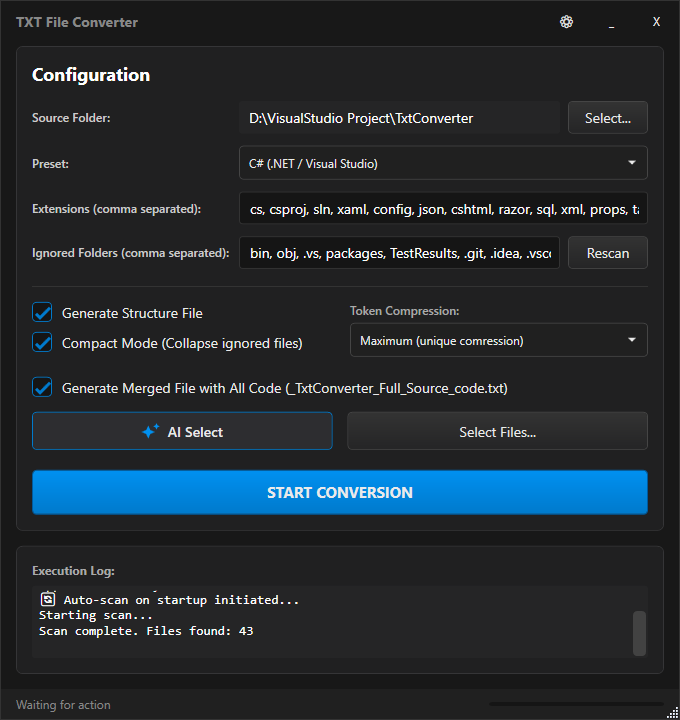
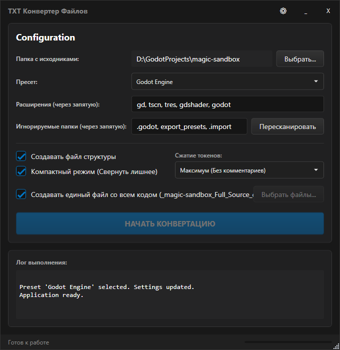

# TxtConverter

[🇷🇺 Читать на русском](#-txtconverter-ru)

**TxtConverter** is a professional desktop utility designed to quickly and safely prepare project source code for analysis by Neural Networks (LLMs), archiving, or sharing in chats.

The application scans your project folder and creates an optimized single text file that is easy to feed into ChatGPT, Claude, DeepSeek, or Gemini.

**⚡ Now rebuilt with .NET 10 & WPF for maximum performance!**

<!-- Screenshots Side-by-Side -->

  
  

---

## 🚀 Why the New Version?
This project is a complete rewrite of the original Java version.
*   **Native Performance:** Built on .NET 10 and WPF.
*   **Single File EXE:** No installation required. Just run and use.
*   **Modern UI:** Dark theme, flat design, responsive interface.

---

## 🔥 Unique Feature: Godot Scene Optimizer
**TxtConverter** features a **unique compression algorithm** specifically designed for **Godot Engine** (`.tscn`, `.tres`) files.

Standard Godot scene files are very verbose and consume a huge amount of LLM context tokens. Our "Maximum" compression mode parses the structure and applies semantic optimization:

1.  **Smart Abbreviation:** Replaces long type names with short aliases (e.g., `MeshInstance3D` → `Mesh`, `CollisionShape3D` → `ColShape`).
2.  **Vector Compaction:** Compresses `Vector3(0, 1, 0)` into compact arrays `[0,1,0]` and removes unnecessary whitespace.
3.  **Property Shortening:** `transform` → `xt`, `position` → `pos`, `rotation_degrees` → `rot`.
4.  **Repetition Collapse:** If the algorithm detects multiple identical nodes (e.g., a grid of 100 tiles), it collapses them into a single syntax: `@Repeated(100) "Mesh"`.

**Result:** A `.tscn` file that used to take **5000 tokens** can be compressed to **~500 tokens**, while keeping the hierarchy fully understandable for the AI.

---

## 🌍 Multilingual Support
The application fully supports **English** and **Russian** languages.
*   **First Run:** You will be prompted to select your preferred language.
*   **Settings:** You can change the language at any time using the Settings (⚙) menu.
*   **Persistence:** Your choice is saved automatically for future sessions.

---

## ⚡ Key Features

### 🚀 Smart Automation & UX
*   **Drag & Drop:** Simply drag your project folder into the application window to start.
*   **Auto-Detection:** The app automatically analyzes project files (e.g., `package.json`, `pom.xml`, `project.godot`) and selects the correct Preset for you.
*   **Smart Persistence:** The app remembers your last used folder, settings, and window position.

### 🧠 Optimization for LLMs (AI)
*   **Token Compression:**
    *   **Smart:** Removes excessive empty lines and normalizes line endings (`LF`).
    *   **Maximum:** Removes all comments, formatting, and applies specific optimizers (like the Godot one mentioned above).
*   **Smart Merging:** You can choose which files to include **fully** and which to keep as **stubs**.
    *   *Example:* If a file is found but not selected for merging, the report will contain: `(Stub)`. This gives the AI context about the file's existence without wasting tokens on its content.

### ⚡ Performance & Safety
*   **Turbo Scanning:** Optimized algorithm instantly skips massive ignored folders (like `node_modules`, `.git`, or `Library`).
*   **Non-Destructive:** The app **never** modifies your source files. All results are saved in a separate `_ConvertedToTxt` folder inside your project.

### ⚙️ Flexibility
*   **Presets:** Ready-made settings for:
    *   **Unity Engine** / **Godot Engine**
    *   **Java (Maven/Gradle)**
    *   **Web (TypeScript/React)** / **Web (JavaScript/Legacy)**
    *   **Python**
    *   **C# (.NET / Visual Studio)**
*   **Structure Map:** Optional generation of a `_FileStructure.md` file (Tree or Flat list).

---

## 🚀 How to Use

1.  Download `TxtConverter.exe` from Releases.
2.  Run it (No installation needed).
3.  **Drag & Drop** your project folder into the window.
4.  The app will try to **Auto-Detect** the preset.
5.  Click **"Rescan"** (if not triggered automatically).
6.  (Optional) Click **"Select Files..."** to check only the scripts you need in full.
7.  Select **Compression Level** (Recommended: *Smart* for code, *Maximum* for huge scenes).
8.  Click the big blue button **"START CONVERSION"**.

---

 
 

# 🇷🇺 TxtConverter (RU)

**TxtConverter** — это профессиональная десктопная утилита для быстрой и безопасной подготовки исходного кода проектов к анализу нейросетями (LLM), архивации или отправке в чаты.

**⚡ Полностью переписанная версия на .NET 10 (WPF)!**

---

## 🔥 Уникальная фишка: Godot Scene Optimizer
В **TxtConverter** встроен **уникальный алгоритм сжатия**, разработанный специально для файлов **Godot Engine** (`.tscn`, `.tres`).

Файлы сцен Godot обычно очень объемные и быстро "съедают" контекст нейросети. Режим сжатия **"Максимум"** применяет семантическую оптимизацию:

1.  **Умные сокращения:** Заменяет длинные названия типов на короткие алиасы (напр. `MeshInstance3D` → `Mesh`, `CollisionShape3D` → `ColShape`).
2.  **Сжатие векторов:** Превращает `Vector3(0, 1, 0)` в компактные массивы `[0,1,0]` без лишних пробелов.
3.  **Сокращение свойств:** `transform` → `xt`, `position` → `pos`.
4.  **Сворачивание повторов:** Если алгоритм находит множество одинаковых узлов (например, тайлы карты), он сворачивает их в одну строку: `@Repeated(100) "Mesh"`.

**Результат:** Файл сцены, который занимал **5000 токенов**, сжимается до **~500 токенов**, при этом ИИ прекрасно понимает структуру сцены.

---

## 🚀 В чем отличия от старой версии?
*   **Скорость:** Нативный код .NET работает значительно быстрее.
*   **Портативность:** Один `exe` файл, не требует установки.
*   **Дизайн:** Современная темная тема и удобный интерфейс.

---

## 🔥 Ключевые возможности

### 🚀 Автоматизация
*   **Drag & Drop:** Просто перетащите папку проекта в окно программы.
*   **Авто-определение:** Приложение само находит ключевые файлы (`project.godot`, `pom.xml`, `package.json`) и выставляет нужный пресет.
*   **Сохранение настроек:** Программа запоминает последнюю папку, пресет и галочки настроек.

### 🧠 Оптимизация для LLM (ИИ)
*   **Сжатие токенов:**
    *   **Умное:** Удаляет лишние пустые строки, нормализует переносы строк (`LF`).
    *   **Максимум:** Агрессивное сжатие, удаление комментариев и использование спец. алгоритмов для движков.
*   **Умное слияние:** Выбор файлов, которые нужны **полностью**, и файлов, которые нужны только как **заглушки** (для контекста).

### ⚙️ Пресеты
*   **GameDev:** Unity, Godot.
*   **Web:** TypeScript (Modern), JavaScript (Classic).
*   **Backend:** Java, Python, C# (.NET).

---

## 🚀 Как использовать

1.  Скачайте `TxtConverter.exe`.
2.  Запустите (Установка не требуется).
3.  **Перетащите папку** проекта в окно.
4.  Приложение автоматически определит тип проекта.
5.  Нажмите **"Начать конвертацию"**.
6.  Заберите готовый файл в папке `_ConvertedToTxt`.

---

*TxtConverter — Making AI coding easier.*
