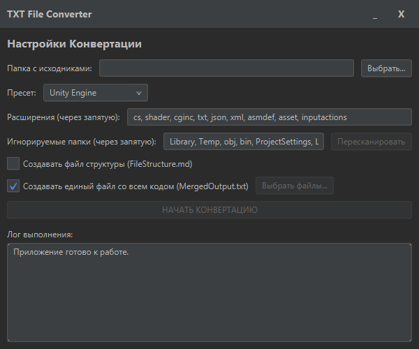

# TxtConverter

Простая и удобная десктопная утилита для безопасного преобразования файлов проекта в формат `.txt`. Идеально подходит для подготовки исходного кода к отправке в текстовые чаты или для анализа.

<!-- 
ВАЖНО: Сделай скриншот работающего приложения и сохрани его как 'screenshot.png' 
в новой папке 'docs' в корне проекта. Затем раскомментируй строку ниже.
-->


---

## 🔥 Ключевые возможности

*   **Безопасная конвертация:** Приложение **никогда не изменяет исходные файлы**. Оно создает копии с расширением `.txt` в отдельной подпапке `_ConvertedToTxt`.
*   **Гибкая настройка:** Укажите любую папку с проектом и перечислите нужные расширения файлов для конвертации.
*   **Удобные пресеты:** Включает готовые наборы расширений для популярных сред, таких как **Godot Engine**, **Java (Maven/Gradle)** и **Web Frontend**.
*   **Графический интерфейс:** Интуитивно понятный интерфейс, построенный на **JavaFX**, с темной темой в стиле современных IDE.
*   **Детальное логирование:** Окно лога в реальном времени показывает прогресс конвертации и сообщает о любых проблемах.
*   **Портативность:** Приложение собирается в самодостаточный пакет, который не требует предварительной установки Java на машине пользователя.

## 🚀 Как использовать (для пользователей)

1.  Перейдите в раздел **[Releases](https://github.com/ВАШ_НИК/TxtConverter/releases)** на этой странице.
2.  Скачайте последнюю версию приложения (обычно в `.zip` архиве).
3.  Распакуйте архив в любое удобное место.
4.  Запустите `TxtConverter.exe`.

## 🛠️ Как собрать из исходников (для разработчиков)

Если вы хотите внести изменения или собрать приложение самостоятельно, следуйте этим шагам.

### Предварительные требования

*   **JDK 21** (или новее). Убедитесь, что `JAVA_HOME` указывает на директорию JDK.
*   **Apache Maven**. Убедитесь, что `mvn` доступен из вашей командной строки.

### Шаги сборки

1.  **Клонируйте репозиторий:**
    ```sh
    git clone https://github.com/ВАШ_НИК/TxtConverter.git
    cd TxtConverter
    ```

2.  **Запустите сборку с помощью Maven:**
    ```sh
    mvn clean package
    ```
    Эта команда скомпилирует исходный код, создаст один "fat-jar" со всеми зависимостями и упакует его в нативный пакет с помощью `jpackage`.

3.  **Найдите результат:**
    Готовое к запуску приложение будет находиться в директории:
    `target/jpackage/TxtConverter/`

    Внутри вы найдете `TxtConverter.exe` и все необходимые для его работы файлы.

## 💻 Технологический стек

*   **Язык:** Java 21
*   **GUI Framework:** JavaFX 21
*   **Система сборки:** Apache Maven
*   **Плагины сборки:**
    *   `maven-shade-plugin` для создания "fat-jar".
    *   `jpackage-maven-plugin` для создания нативного `.exe`.

## 🤝 Вклад

Если у вас есть идеи по улучшению, не стесняйтесь создавать **Issues** или присылать **Pull Requests**. Любой вклад приветствуется!

---

*Этот проект был создан в сотрудничестве с ИИ-ассистентом.*
